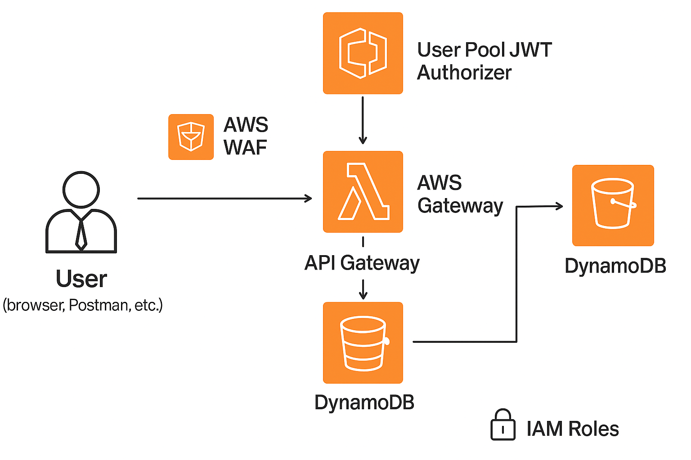

## AWS Serverless Security Lab

Secure Serverless Application with Lambda, API Gateway, Cognito and WAF.

---

## Table of Contents

- [Overview](#overview)
- [Real-World Risk](#real-world-risk)
- [What I Built](#what-i-built)
- [Diagram](#diagram)
- [Objectives](#objectives)
- [Steps Performed](#steps-performed)
  - [1. API Gateway Setup]
  - [2. Cognito User Pool Setup]
  - [3. Cognito Authorizer Configuration]
  - [4. Lambda Function and IAM Policy]
  - [5. DynamoDB Table Creation]
  - [6. Authorization Testing]
  - [7. AWS WAS Limitation Notice]
  - [8. Cleanup]
- [Screenshots](#screenshots)
- [Known Limitations](#known-limitations)
- [Lessons Learned](#lessons-learned)
- [Authentication Troubleshooting](#authentication-troubleshooting)
- [References](#references)
- [Contact](#contact)

--- 

## Overview

In this lab, you built a secure serverless application on AWS using Lambda, API Gateway, DynamoDB, Amazon Cognito, and AWS WAF. You configured authentication and authorization with Cognito user pools, protected your API with WAF, and implemented fine-grained IAM policies. The lab demonstrates best practices for securing serverless apps.

---

## Real-World Risk

In modern cloud applications, securing serverless APIs is critical to prevent unauthorized access and data breaches. This lab addresses real-world risks such as unauthorized users invoking backend Lambda functions, which could lead to data exposure or manipulation. It mitigates common web exploits like SQL injection and cross-site scripting by integrating AWS WAF as a protective firewall. The use of fine-grained IAM roles ensures least privilege access, limiting the potential attack surface by restricting permissions only to what is strictly necessary. Additionally, securing API Gateway endpoints with Cognito authentication and JWT tokens prevents public exposure of sensitive resources, safeguarding both the application and its data from malicious actors.

---

## What I Built 

- A secure serverless API application using:
  - AWS Lambda (Python/Node.js) running backend code.
  - API Gateway serving RESTful endpoints with Cognito-based JWT authentication.
  - DynamoDB NoSQL table for data persistence with scoped access.
  - AWS WAF protecting API Gateway from common web exploits.
  - IAM roles with least privilege scoped to Lambda and DynamoDB.
- Comprehensive documentation including architecture diagram, code, and test screenshots.

---

## Diagram

---

## Objectives

- Deploy a Lambda-based REST API using API Gateway.
- Use DynamoDB as the backend data store.
- Implement user authentication with Amazon Cognito user pools.
- Secure the API Gateway with JWT authorizer and AWS WAF.
- Apply least privilege IAM role permissions to Lambda.
- Validate input and secure API endpoints against unauthorized access.

---

## Steps Performed

**1. API Gateway Setup**
   - Created a REST API named Lab8Api with routes /items supporting GET and POST methods *(Screenshot: `apigateway-routes.png`)*
   - Configured the API Gateway stage for deployment and obtained the stage URL *(Screenshot: `apigateway-stage-url.png`)*

**2. Cognito User Pool Setup**
   - Created a Cognito user pool for authentication and user management *(Screenshot: `cognito-userpool.png`)*

**3. Cognito Authorizer Configuration**
   - Configured Cognito user pool authorizer on API Gateway to protect the /items route *(Screenshot: `apigateway-cognito-auth.png`)*

**4. Lambda Function and IAM Policy**
   - Developed the Lambda function Lab8ApiFunction with code for item creation and retrieval *(Screenshot: `lambda-user-isolation.png`)*
   - Applied a scoped IAM policy to the Lambda execution role to restrict DynamoDB access *(Screenshot: `lambda-iam-policy.png`)*

**5. DynamoDB Table Creation**
   - Created DynamoDB table Lab8Items with a primary key id *(Screenshot: `dynamodb-table-created.png`)*

**6. Authorization Testing**
   - Tested Lambda function with authorized and unauthorized requests via Postman including JWT tokens *(Screenshot: `postman_401_unauthorized.png`)*

**7. AWS WAF Limitation Notice**
   - Documented the regional limitations of AWS WAF in the console, impacting resource association *(Screenshot: `waf-unavailable-limitation.png`)*

**8. Cleanup**
   - Removed all AWS resources created for the lab, including Lambda functions, API Gateway, DynamoDB table, Cognito user pool and WAF configurations to avoid ongoing charges.
     
---

## Screenshots

*All screenshots are included in the screenshots/ folder.*

| Step | Filename                       | Description                                                       |
| ---- | ------------------------------ | ----------------------------------------------------------------- |
| 1    | dynamodb-table-created.png     | DynamoDB table creation with partition key configuration          |
| 2    | lambda-iam-policy.png          | IAM policy attached to Lambda function with scoped permissions    |
| 3    | lambda-user-isolation.png      | Lambda function code showing user input isolation and validation  |
| 4    | apigateway-cognito-auth.png    | Cognito authorizer setup attached to API Gateway routes           |
| 5    | apigateway-routes.png          | API Gateway configuration showing GET and POST `/items` routes    |
| 6    | apigateway-stage-url.png       | API Gateway deployed stage URL                                    |
| 7    | cognito-userpool.png           | Cognito user pool and app client setup with OAuth flows           |
| 8    | postman-401-unauthorized.png   | Postman request with invalid token showing 401 Unauthorized error |
| 9    | waf-unavailable-limitation.png | AWS WAF console showing limitations due to regional constraints   |

---

## Known Limitations

- AWS WAF regional scope restrictions limited full integration with API Gateway.  
- See the WAF limitation screenshot for details.

---

## Lessons Learned

- Cognito user pools provide robust user authentication with OAuth 2.0 flows.
- API Gateway JWT authorizers enforce secure access control for REST APIs.
- AWS WAF can block common web attacks like SQL injection and XSS.
- Proper IAM role scoping reduces attack surface for Lambda functions.
- Input validation is crucial to avoid unauthorized data manipulation.
- Testing tokens and API requests is essential for verifying security controls.

---

## Authentication Troubleshooting

- Encountered 401 Unauthorized errors due to token issues during testing.  
- Importance of using valid Access Tokens and correct Authorization header format emphasized.  
- Correct API Gateway authorizer and route setup is critical for successful authentication.

---

## References

- [Amazon Cognito User Pools](https://docs.aws.amazon.com/cognito/latest/developerguide/cognito-user-pools.html)
- [API Gateway JWT Authorizers](https://docs.aws.amazon.com/apigateway/latest/developerguide/apigateway-integrate-with-cognito.html)
- [AWS WAF Overview](https://aws.amazon.com/waf/)
- [AWS Lambda Security Best Practices](https://docs.aws.amazon.com/lambda/latest/dg/best-practices.html)

---

## Contact

Sebastian Silva C. – July, 2025 – Berlin, Germany.  
[LinkedIn](https://www.linkedin.com/in/sebastiansilc) | [GitHub](https://github.com/SebaSilC) | [sebastian@playbookvisualarts.com](mailto:sebastian@playbookvisualarts.com)

